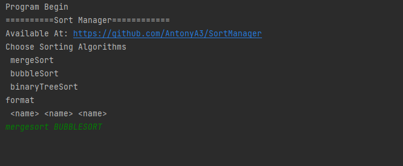
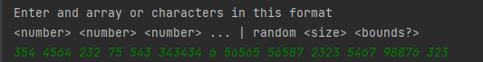
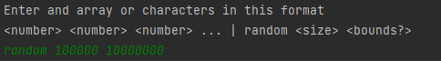
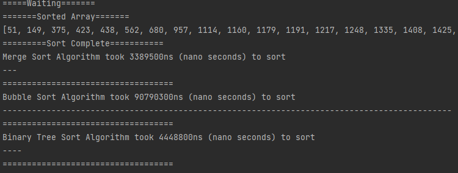
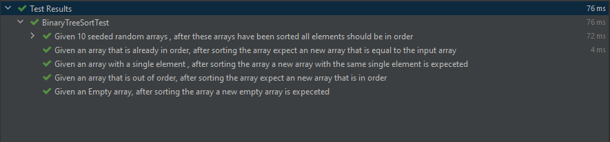
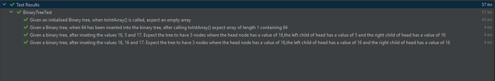
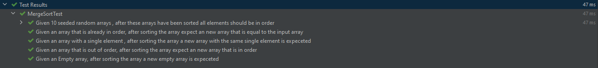
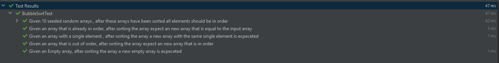

# Sort Manager Project

## Summary
The sort Manager project is a command line application that allows the user (you) to input numbers in an 
array which you can sort and compare how, long it takes each algorithm to sort the arrays provided.
The goal of this project was to demonstate the knowledge and
understanding of the **Log4J**, Design Patterns in particular the **Facade** and **Abstract Factory** design
pattern and also **JUnit** and The **Model View Controller** Architectural Pattern.

## Dependancies

These dependancies are required for testing and running of the application. These should
be added to the pom.xml file.

Junit Dependancy
        
    <dependency>
        <groupId>org.junit.jupiter</groupId>
        <artifactId>junit-jupiter</artifactId>
        <version>5.8.2</version>
    </dependency>

Log4j Dependancies

    <dependency>
        <groupId>org.apache.logging.log4j</groupId>
        <artifactId>log4j-core</artifactId>
        <version>2.17.1</version>
    </dependency>
    <dependency>
        <groupId>org.apache.logging.log4j</groupId>
        <artifactId>log4j-api</artifactId>
        <version>2.17.1</version>
    </dependency>

## Tutorial

1. First Enter one or many of the options for sorting algorithms

2. You can either enter an array or in the format specified.

3. The array will be sorted and the result will be outputted. In the results section the **'-'** compares how long each of these algorithms have take in relation to each other.

4. Press Y to continue or N to leave the program

## Test Result
All unit tests have passed for this project
### BinaryTreeSortTest

### BinaryTreeTest

### MergeSortTest

### BubbleSortTest

